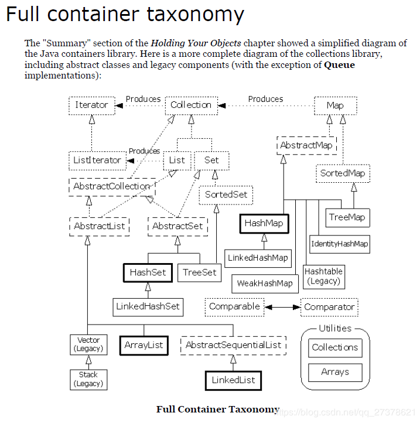

## JAVA容器

主要总结Map,List,Set

### transient

在JDK源代码中经常会发现容器的内部变量使用transient修饰，这个关键字的作用是使被修饰的变量不被序列化，主要目的是为了节约磁盘空间，因为容器中的数组长度通常是大于实际存储的值的长度。并且JDK重写了writeObject来进行序列化，只保存实际存储的内容。

### List

在JAVA中常被问到的List类型右Vector,ArrayList和LinkedList

#### ArrayList

arrayList底层是普通数组，默认容量为 10,每次扩容会变成原来的1.5倍。为实现泛型/多态，底层使用Object作为数组类型。为了节约空间，当new数组但并没有赋值时，它的容量是0，然后当添加第一个值，他会扩容到10，而后每当大于长度时都扩展为1.5倍。然后检查新容量是否大于最小需要容量，若还是小于最小需要容量，那么久把最小需要容量当作数组的新容量，再检查新容量是否大于集合的最大容量如果大则也用最小需求容量。

手动实现代码如下：

~~~java
public class myArrayList<E>{
    private Object []elements;
    private int size;
    private static final int defaultSize = 10;
    private static final Object[] defaultArray={}
    public myArrayList(int initialSize){
        if(initialSize<0){
            throw new Exception("List长度不能是负数");
        }else if(initialSize==0){
            this.element=defaultArray;
        }else{
            this.element= new Object[initialSize]
        }
    }
    public myArrayList(){
        this.elements = defaultArray;
    }
    public boolean add(Object o){
        if(this.size == elements.length){
            Object[] newElements=new Object[1.5*this.size];
            System.arraycopy(this.elements,0,newElements,0,size);
            this.elements = newElements;
        }
        elements[size++]=o;
        return true;
    }
    public E remove(int index){
        rangeCheck(indedx);
        Object oldValue = elements[index];
        int numMoved = size-index-1;
        if(numMoved>0){
            System.arraycopy(elements,index+1,elements,index,numMoved);
        }
        elements[--size]=null;
        return (E)oldValue;
    }
    public boolean remove(Object o){
        if(null==o){
            for(int i=0;i<size;i++){
                if(null==elements[i]){
                    remove(i);
                    return true;
                }
            }
        }else{
            for(int i=0;i<size;i++){
                if(elements[i].equals(o)){
                    remove(i);
                    return true;
                }
            }
        }
        return false;
    }
    public void rangeCheck(int index){
        if(index<0||index>=size){
            throw new IndexOutOfBoundsException(""+index);
        }
    }
} 
~~~

#### LinkedList

LinkedList基于双向链表适用于增删频繁且查询不频繁的场景，线程不安全的且适用于单线程。

~~~java

public class LinkedList<E>{
    private int size=0;
    private Node<E> first;
    private Node<E> last;
    private static class Node<E>{
        E item;
        Node<E> next;
        Node<E> prev;
        //构造函数略，就是三个属性都赋值
    }
    public void checkPositionIndex(int index){
        if (!(index>=0 && index<size)){
            throw new IndexOutOfBoundsException(index.toString());
        }
    }
    public boolean add(E e){
        linkLast(e);
        return true;
    }
    void linkLast(E e){
        final Node<E> l =last;
        final Node<E> newNode = new Node<>(l,e,null);
        last = newNode;
        if(l==null)
            first = newNode;
        else
            l.next=newNode;
        size++;
    }
    Node<E> get(int index){
        //当index大于size的一半时，从后向前查找，否则从前向后
        if(index<(size>>1)){
            Node<E> x =first;
            for(int i=0;i<index,i++)
                x =x.next;
            return x;
        }else{
            Node<E> x = last;
            for(int i=size-1;i>index;i--)
                x=x.prev;
            return x;
        }
    }
    void linkBefore(E e,Node<E> succ){
        final Node<E> pred = succ.prev;
        final Nonde<E> newNode = new Node<>(pred,e,succ);
        succ.prev = newNode;
        if(pred == null)
            first = newNode;
        else
            pred.next = newNode;
        size++;
    }
}
~~~

#### Vector

​		Vector实现了List接口，与ArrayList一样可以维护一个插入顺序，但ArrayList比Vector快，它是非同步的，若涉及到多线程，用Vector会比较好一些，在非多线程环境中，Vector对于元素的查询、添加、删除和更新操作效果不是很好。
​        Vector 可实现自动增长的对象数组。 java.util.vector提供了向量类(vector)以实现类似动态数组的功能。创建了一个向量类的对象后，可以往其中随意插入不同类的对象，即不需顾及类型也不需预先选定向量的容量，并可以方便地进行查找。对于预先不知或者不愿预先定义数组大小，并且需要频繁地进行查找，插入，删除工作的情况。可以考虑使用向量类。

### Map

#### HashMap

实际是使用数组存储的包装类，计算hash值后与当前数组长度做&运算计算当前key,value应当放入的下标。如果产生冲突则转成单向链表，实际Node对象确实有next属性。在 JDK1.7及以前的版本中，HashMap里是没有红黑树的实现的，在JDK1.8中加入了红黑树是为了防止哈希表碰撞攻击，当链表链长度为8时，及时转成红黑树，提高map的效 率。并且hashmap扩容的时候会变成2的n次幂，其他数的时候会导致某位为0，数组的某个下标永远无法使用。

对比hashTable，hashMap支持空键和空值。hashTable默认大小为11并且每次扩充是2n+1这导致有些数组位置永远取不到，并且位运算效率低。但hashTable是线程安全的 使用了synchronized描述符

首先将链表的第一个元素设为红黑树的根节点，然后依次遍历余下节点，根据余下节点的hash值来判断插入左子树还是右子树。插入后再对树进行调整使其符合红黑树的性质。

插入的时候，先比较key的hash值来决定插入方向，如果hash值相等的话，再比较`compare`方法，如果key所属对象没有直接实现`Comparable`接口，或者`compare`方法返回0，执行`tieBreakOrder`，比较两个key所属Class的name，如果还相等，也就是两个对象是同一个类型，那么调用本地方法为两个对象生成`hashCode`值，再进行比较，`hashCode`相等的话返回-1。

#### HashTable

Hashtable 的函数都是**同步的**，这意味着它是线程安全的。它的key、value都不可以为null。此外，Hashtable中的映射不是有序的。

#### TreeMap

TreeMap 是一个**有序的key-value集合**，它是通过红黑树实现的。
TreeMap **继承于AbstractMap**，所以它是一个Map，即一个key-value集合。
TreeMap 实现了NavigableMap接口，意味着它**支持一系列的导航方法。**比如返回有序的key集合。

TreeMap基于**红黑树（Red-Black tree）实现**。该映射根据**其键的自然顺序进行排序**，或者根据**创建映射时提供的 Comparator 进行排序**，具体取决于使用的构造方法。
TreeMap的基本操作 containsKey、get、put 和 remove 的时间复杂度是 log(n) 。

#### CoCurrcentMap

ConcurrentHashMap用volatile 修饰，保证线程安全。

Base 1.7
Segment 是 ConcurrentHashMap 的一个内部类，主要的组成如下：
和 HashMap 非常类似，唯一的区别就是其中的核心数据如 value ，以及链表都是 volatile 修饰的，保证了获取时的可见性。

原理上来说：ConcurrentHashMap 采用了分段锁技术，其中 Segment 继承于 ReentrantLock。不会像 HashTable 那样不管是 put 还是 get 操作都需要做同步处理，理论上 ConcurrentHashMap 支持 CurrencyLevel (Segment 数组数量)的线程并发。每当一个线程占用锁访问一个 Segment 时，不会影响到其他的 Segment。

下面也来看看核心的 put get 方法。

put

将当前 Segment 中的 table 通过 key 的 hashcode 定位到 HashEntry。
遍历该 HashEntry，如果不为空则判断传入的 key 和当前遍历的 key 是否相等，相等则覆盖旧的 value。
不为空则需要新建一个 HashEntry 并加入到 Segment 中，同时会先判断是否需要扩容。
最后会解除在 1 中所获取当前 Segment 的锁。

get 逻辑比较简单：

只需要将 Key 通过 Hash 之后定位到具体的 Segment ，再通过一次 Hash 定位到具体的元素上。

由于 HashEntry 中的 value 属性是用 volatile 关键词修饰的，保证了内存可见性，所以每次获取时都是最新值。

ConcurrentHashMap 的 get 方法是非常高效的，因为整个过程都不需要加锁。

Base 1.8

也将 1.7 中存放数据的 HashEntry 改为 Node，但作用都是相同的。

其中的 val next 都用了 volatile 修饰，保证了可见性。
put

根据 key 计算出 hashcode 。
判断是否需要进行初始化。
f 即为当前 key 定位出的 Node，如果为空表示当前位置可以写入数据，利用 CAS 尝试写入，失败则自旋保证成功。
如果当前位置的 hashcode == MOVED == -1,则需要进行扩容。
如果都不满足，则利用 synchronized 锁写入数据。
如果数量大于 TREEIFY_THRESHOLD 则要转换为红黑树。

get
根据计算出来的 hashcode 寻址，如果就在桶上那么直接返回值。
如果是红黑树那就按照树的方式获取值。
就不满足那就按照链表的方式遍历获取值。

#### WeakHashMap

1 **HashMap实现了Cloneable和Serializable接口，而WeakHashMap没有。**
  HashMap实现Cloneable，意味着它能通过clone()克隆自己。
  HashMap实现Serializable，意味着它支持序列化，能通过序列化去传输。

2 **HashMap的“键”是“强引用(StrongReference)”**，而**WeakHashMap的键是“弱引用(WeakReference)”。**
  WeakReference的“弱键”能实现WeakReference对“键值对”的动态回收。当“弱键”不再被使用到时，GC会回收它，WeakReference也会将“弱键”对应的键值对删除。
  这个“弱键”实现的动态回收“键值对”的原理呢？其实，通过WeakReference(弱引用)和ReferenceQueue(引用队列)实现的。 首先，我们需要了解WeakHashMap中：
  第一，“键”是WeakReference，即key是弱键。
  第二，ReferenceQueue是一个引用队列，它是和WeakHashMap联合使用的。当弱引用所引用的对象被垃圾回收，Java虚拟机就会把这个弱引用加入到与之关联的引用队列中。 WeakHashMap中的ReferenceQueue是queue。
  第三，WeakHashMap是通过数组实现的，我们假设这个数组是table。

接下来，说说“动态回收”的步骤。

(01) **新建WeakHashMap，将“键值对”添加到WeakHashMap中。**
    将“键值对”添加到WeakHashMap中时，添加的键都是弱键。
    实际上，WeakHashMap是通过数组table保存Entry(键值对)；每一个Entry实际上是一个单向链表，即Entry是键值对链表。
(02) **当某“弱键”不再被其它对象引用，并被GC回收时。在GC回收该“弱键”时，这个“弱键”也同时会被添加到queue队列中。**
    例如，当我们在将“弱键”key添加到WeakHashMap之后；后来将key设为null。这时，便没有外部外部对象再引用该了key。
    接着，当Java虚拟机的GC回收内存时，会回收key的相关内存；同时，将key添加到queue队列中。
(03) **当下一次我们需要操作WeakHashMap时，会先同步table和queue。table中保存了全部的键值对，而queue中保存被GC回收的“弱键”；同步它们，就是删除table中被GC回收的“弱键”对应的键值对。**
    例如，当我们“读取WeakHashMap中的元素或获取WeakReference的大小时”，它会先同步table和queue，目的是“删除table中被GC回收的‘弱键’对应的键值对”。删除的方法就是逐个比较“table中元素的‘键’和queue中的‘键’”，若它们相当，则删除“table中的该键值对”。

### Set

比较完list和map，set的容器种类实际上已经不需要详细写了。

set的实现有 hashSet 和TreeSet。看名字就知道，hashSet是数组实现，TreeSet是红黑树实现。